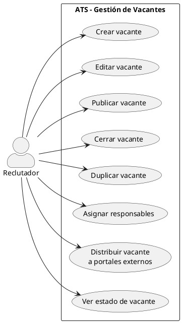
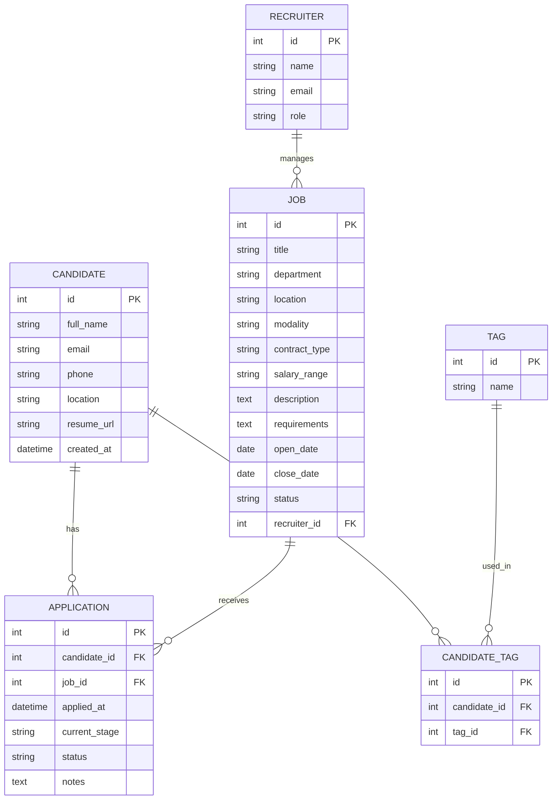
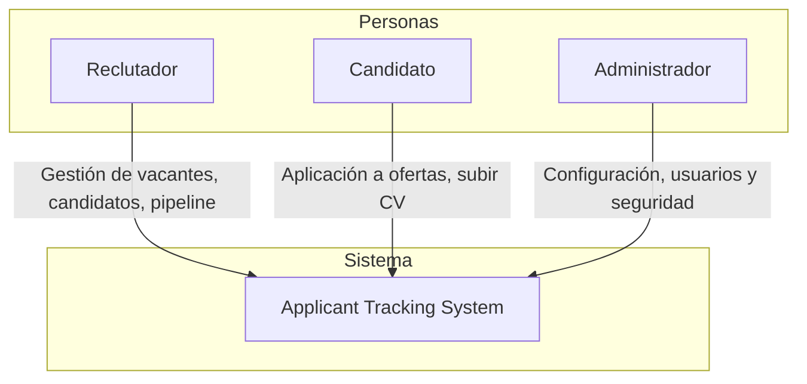
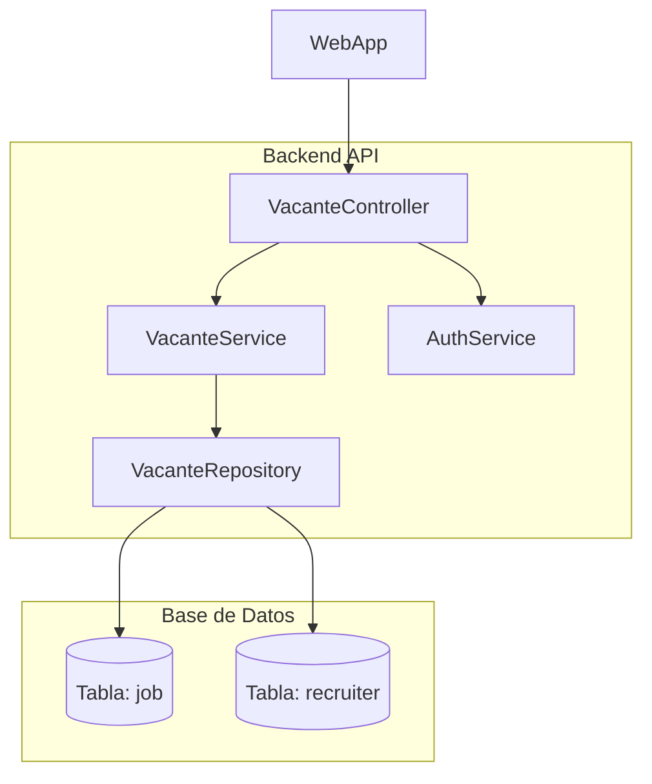

✅ Descripción breve de un ATS

Un Applicant Tracking System (ATS) es una herramienta de software diseñada para automatizar y optimizar el proceso de reclutamiento. Permite a las empresas gestionar de forma eficiente la recepción, organización, filtrado y seguimiento de candidaturas desde una única plataforma, integrando funcionalidades como publicación de ofertas, screening de CVs, entrevistas y reportes.

⭐ Valores añadidos de un ATS

    Ahorro de tiempo y recursos
    Automatiza tareas repetitivas como el filtrado de CVs, envío de emails y agendado de entrevistas.

    Mejora la experiencia del candidato
    Proporciona una aplicación más ágil, comunicación fluida y seguimiento en tiempo real.

    Reducción del sesgo
    Al estandarizar criterios de evaluación y aplicar filtros objetivos, ayuda a decisiones más imparciales.

    Centralización de procesos
    Toda la información (CVs, entrevistas, evaluaciones, feedback) se guarda en un solo lugar, facilitando el acceso colaborativo.

    Análisis y mejora continua
    Genera métricas clave como tiempo de contratación, fuentes de talento más efectivas o tasa de conversión por etapa.

    Adaptabilidad y escalabilidad
    Se ajusta al crecimiento de la empresa y puede integrarse con otras herramientas (RRHH, CRM, LinkedIn, etc.).

## ✅ **Lean Canvas – ATS (Freemium + SaaS)**

| Sección                                   | Contenido                                                                                                                                                                                                                                              |
| ----------------------------------------- | ------------------------------------------------------------------------------------------------------------------------------------------------------------------------------------------------------------------------------------------------------ |
| **1. Problema**                           | - Reclutamiento ineficiente por exceso de tareas manuales<br>- Dificultad para filtrar candidatos de calidad<br>- Coste elevado o poca flexibilidad de las herramientas actuales                                                                       |
| **2. Segmentos de clientes**              | - Startups y PYMEs sin equipo de RRHH<br>- Reclutadores independientes<br>- Departamentos de RRHH en empresas medianas<br>- Consultoras de selección                                                                                                   |
| **3. Propuesta de valor única**           | Un ATS ágil y accesible que automatiza procesos de selección desde el día uno, con una versión gratuita potente y opciones premium para escalar sin fricción.                                                                                          |
| **4. Solución**                           | - Plataforma cloud con pipeline visual, filtros automáticos, y panel colaborativo<br>- Integración con bolsas de empleo, LinkedIn y correo<br>- Plan freemium para empezar sin coste<br>- Planes premium escalables con funcionalidades avanzadas      |
| **5. Canales**                            | - Inbound Marketing (SEO, blog, RRSS)<br>- Alianzas con escuelas de negocio y consultoras<br>- Marketplaces de software (G2, Capterra)<br>- Referral program entre usuarios                                                                            |
| **6. Fuentes de ingreso**                 | - Suscripciones mensuales/anuales (SaaS) por plan: Starter, Growth, Pro<br>- Add-ons (evaluaciones psicométricas, IA para screening, API, informes personalizados)<br>- Servicios extra: soporte dedicado, integración con ERP                         |
| **7. Costes clave**                       | - Desarrollo y mantenimiento de software<br>- Infraestructura cloud (hosting, backups, seguridad)<br>- Marketing y adquisición de usuarios<br>- Soporte al cliente y formación<br>- Coste de integraciones (API externas)                              |
| **8. Métricas clave**                     | - CAC (Costo de adquisición de cliente)<br>- Tasa de conversión freemium → pago<br>- Churn rate<br>- LTV (valor del cliente en el tiempo)<br>- Tasa de adopción de funcionalidades premium                                                             |
| **9. Ventaja injusta (Unfair Advantage)** | - Algoritmo de screening optimizado con IA propia<br>- Onboarding ultra rápido (publica y recibe candidatos en minutos)<br>- Comunidad de usuarios que genera referidos<br>- Integraciones plug & play con herramientas populares (Slack, Gmail, etc.) |

---

Este enfoque permite capturar una base amplia de usuarios sin barrera de entrada (freemium) y convertirlos a planes de pago conforme aumentan sus necesidades o crece su negocio.

## Funcionalidades básicas de un ATS para un MVP (ordenadas de mayor a menor prioridad):

✅ Funcionalidades básicas de un ATS para un MVP (ordenadas de mayor a menor prioridad):

1. Gestión de vacantes (Job posting)

Descripción:
Permite crear, editar y publicar ofertas de empleo desde la plataforma.

Por qué es clave:
Es el punto de entrada al proceso de selección. Sin vacantes, no hay candidatos.

2. Recepción y almacenamiento de candidatos (Applicant database)

Descripción:
Registro centralizado donde se almacenan todos los CVs y datos de candidatos aplicantes.

Por qué es clave:
Es la base de cualquier seguimiento. Organiza la información y evita la dispersión (emails, Excel, etc.).

3. Pipeline visual de selección (Kanban de etapas)

Descripción:
Visualización del proceso de selección en columnas: Aplicado → Entrevista → Oferta → Contratado / Rechazado.

Por qué es clave:
Ayuda a seguir fácilmente en qué etapa está cada candidato. Mejora la trazabilidad y colaboración.

4. Formulario de aplicación y parsing de CV básico

Descripción:
Formulario web donde los candidatos aplican, con extracción automática de datos clave del CV (nombre, email, experiencia).

Por qué es clave:
Facilita la entrada de datos estructurados sin depender de lectura manual.

5. Búsqueda y filtros en la base de candidatos

Descripción:
Permite buscar por nombre, vacante, experiencia, palabras clave, etc.

Por qué es clave:
Hace eficiente la navegación por grandes volúmenes de datos.

6. Comentarios internos y etiquetas por candidato

Descripción:
Notas privadas, comentarios de entrevistas, y etiquetado personalizable (ej. “Top”, “Tech”, “Revisar después”).

Por qué es clave:
Fomenta el trabajo colaborativo entre reclutadores y la clasificación inteligente.

7. Gestión de estados y decisiones (contratado, descartado, en proceso)

Descripción:
Permite registrar la decisión final sobre cada candidato y moverlos al estado correspondiente.

Por qué es clave:
Facilita reportes básicos y evita ambigüedades en la gestión del proceso.

8. Comunicación con candidatos (email básico)

Descripción:
Posibilidad de enviar mensajes desde la plataforma (respuestas automáticas, feedback, citas).

Por qué es clave:
Aunque puede hacerse fuera del ATS en fases iniciales, una comunicación mínima dentro del sistema mejora la eficiencia.

9. Exportación de datos / reportes básicos

Descripción:
Descargar datos en Excel o PDF para informes simples (número de candidatos, tasa de conversión, etc.).

Por qué es útil (aunque no urgente):
Ideal para análisis manual al principio. Puede postergarse si no es crítico.

## Caso de uso: Gestión de Vacantes

1. Nombre del caso de uso:

Gestión de Vacantes

2. Actor principal:

   Reclutador / Responsable de RRHH

3. Objetivo:

Permitir al reclutador crear, editar, publicar y gestionar ofertas de empleo dentro del ATS de forma eficiente y centralizada.

4. Precondiciones:

   El usuario está autenticado en el sistema.

   Tiene permisos para crear o editar vacantes.

5. Flujo principal (escenario básico):
   Paso 1: Acceder al módulo de vacantes

El reclutador entra en el panel de control y selecciona "Crear nueva vacante" o accede a la lista de vacantes existentes.
Paso 2: Completar los datos de la vacante

El sistema muestra un formulario con campos clave:

    Título del puesto

    Departamento o área

    Modalidad (presencial, híbrido, remoto)

    Ubicación

    Tipo de contrato

    Rango salarial (opcional)

    Descripción del puesto

    Requisitos (técnicos y blandos)

    Idiomas / certificaciones

    Fecha de publicación y cierre

Paso 3: Guardar y publicar la vacante

El reclutador puede:

    Guardar como borrador

    Publicar directamente (si tiene permisos)

    Compartir con otros usuarios internos para validación

Paso 4: Distribución automática (si aplica)

El sistema ofrece opciones de distribución:

    Publicar en portal de empleo propio

    Compartir en redes sociales (LinkedIn, etc.)

    Integrar con portales externos (opcional en futuras versiones)

Paso 5: Visualizar el estado de la vacante

La vacante aparece en un panel con métricas básicas:

    Nº de candidatos aplicados

    Estado: Activa / Cerrada / Borrador

    Fecha de publicación

    Responsable asignado

6. Flujos alternativos:

   Editar vacante existente: El reclutador accede a una vacante publicada y modifica su contenido.

   Duplicar vacante: Crear una nueva vacante a partir de otra ya existente.

   Cerrar vacante: Una vez cubierta, el sistema permite cerrarla manual o automáticamente (basado en fecha o contratación).

   Asignar responsables: Permite que varios usuarios gestionen una misma vacante.

7. Postcondiciones:

   La vacante queda registrada en el sistema.

   Está disponible para recibir candidaturas (si está publicada).

   El sistema inicia el tracking de métricas por vacante.

8. Reglas de negocio clave:

   No se puede publicar una vacante sin campos obligatorios completos.

   Las vacantes cerradas no aceptan nuevas aplicaciones.

   Los usuarios sin permisos no pueden eliminar vacantes.

   Cada vacante debe tener un responsable asignado.

9. Requisitos técnicos relacionados:

   Base de datos estructurada para almacenar los campos de vacantes

   API REST para CRUD de vacantes

   Motor de búsqueda para listar y filtrar vacantes

   Lógica de permisos por rol



🧩 1. Recepción y almacenamiento de candidatos (Applicant Database)
✅ Descripción funcional:

Objetivo:
Centralizar la información de todos los candidatos que aplican a vacantes, asegurando su trazabilidad y disponibilidad en un repositorio estructurado.
👤 Actor principal:

    Candidato

    Reclutador

🔄 Flujos principales:

    El candidato aplica a una vacante.

    El sistema almacena su información en la base de datos.

    El reclutador accede a la ficha del candidato.

    El reclutador puede actualizar el estado, añadir notas o etiquetar.

    El sistema permite búsqueda y filtrado de candidatos.

📐 Reglas de negocio clave:

    Cada aplicación debe estar vinculada a una vacante.

    No se permite duplicar candidatos exactos (misma vacante, mismo correo).

    Se almacena historial de cada aplicación.

📄 PlantUML – Applicant Database

```PlantUML

@startuml
left to right direction
skinparam packageStyle rectangle
skinparam actorStyle awesome

actor "Candidato" as C
actor "Reclutador" as R

rectangle "ATS - Applicant Database" {

usecase "Aplicar a vacante" as UC1
usecase "Guardar datos del candidato" as UC2
usecase "Vincular candidato a vacante" as UC3
usecase "Ver perfil del candidato" as UC4
usecase "Actualizar estado del candidato" as UC5
usecase "Añadir notas o etiquetas" as UC6
usecase "Buscar/filtrar candidatos" as UC7

}

C --> UC1
UC1 --> UC2
UC2 --> UC3

R --> UC4
R --> UC5
R --> UC6
R --> UC7
UC3 --> UC4

@enduml

```

🧩 2. Formulario de aplicación y parsing de CV básico
✅ Descripción funcional:

Objetivo:
Permitir que los candidatos apliquen a una vacante mediante un formulario estructurado y, opcionalmente, subir su CV para extracción automática de información (parsing).
👤 Actor principal:

    Candidato

🔄 Flujos principales:

    El candidato accede al formulario de una vacante.

    Completa campos obligatorios y adjunta su CV.

    El sistema hace parsing del CV y extrae datos clave (nombre, email, experiencia).

    Se muestra vista previa para confirmación.

    El sistema registra la aplicación y la asocia con la vacante.

📐 Reglas de negocio clave:

    Parsing debe fallar con retroalimentación clara si el CV no es legible.

    Campos como nombre y email deben estar presentes antes de enviar.

    El sistema debe permitir revisión antes de enviar la aplicación.

📄 PlantUML – Formulario + Parsing de CV

```PlantUML

@startuml
left to right direction
skinparam packageStyle rectangle
skinparam actorStyle awesome

actor "Candidato" as C

rectangle "ATS - Formulario de aplicación + CV Parsing" {

usecase "Acceder a formulario de vacante" as UC1
usecase "Completar campos y subir CV" as UC2
usecase "Realizar parsing del CV" as UC3
usecase "Previsualizar y confirmar envío" as UC4
usecase "Enviar aplicación" as UC5

}

C --> UC1
C --> UC2
UC2 --> UC3
UC3 --> UC4
UC4 --> UC5

@enduml

```

## ✅ **Modelo de datos ER en Mermaid (ATS básico)**



## 🧩 DISEÑO GENERAL DEL SISTEMA ATS – EXPLICADO POR PARTES

El sistema se estructura en **5 capas principales**:

---

### 1. 🧭 **Capa de Presentación (Frontend / UI)**

Interfaz web accesible para:

- **Reclutadores** (gestión de vacantes, candidatos, pipeline)
- **Candidatos** (aplicación, formulario, carga de CV)
- **Administradores** (gestión de usuarios y permisos)

**Tecnologías sugeridas**: React, Vue, Next.js, TailwindCSS

**Módulos clave:**

- Página de login / registro
- Dashboard de vacantes
- Formulario de aplicación
- Vista de candidato y su progreso
- Kanban del pipeline de selección

---

### 2. 🧠 **Capa de Lógica de Negocio (Backend / API)**

Expone una **API RESTful o GraphQL** para manejar:

- CRUD de vacantes, candidatos y aplicaciones
- Procesamiento de parsing de CV
- Gestión de etiquetas, estados y comunicación
- Validaciones, control de permisos y autenticación

**Tecnologías sugeridas**: Node.js, Python (FastAPI o Django), Laravel, Java Spring Boot

---

### 3. 🗄️ **Capa de Persistencia de Datos (Base de datos)**

Modelo entidad-relación ya definido (ver mensaje anterior) con las entidades:

- `CANDIDATE`, `JOB`, `APPLICATION`, `RECRUITER`, `TAG`, `CANDIDATE_TAG`

**Tecnologías sugeridas**: PostgreSQL, MySQL, MongoDB (si es no relacional)

---

### 4. 🤖 **Servicios auxiliares (parsing y notificaciones)**

- **Parsing de CV** (extracción automática de datos desde PDF/Word): puede usar una librería como `pyresparser` o una API externa como Sovren o Affinda.
- **Envío de correos**: notificación de aplicación recibida, estado actualizado, etc.
- **Almacenamiento de archivos**: CVs en S3, Cloudinary o similar.

---

### 5. 🔐 **Seguridad y Autenticación**

- JWT o OAuth para reclutadores y admin
- Captcha o validaciones para candidatos
- Control de roles: Admin, Reclutador, Viewer

---

## 🖼️ DIAGRAMA GENERAL DEL SISTEMA – MERMAID

```mermaid
graph TD
  subgraph Frontend [Capa de Presentación]
    A1[Portal del Reclutador]
    A2[Portal del Candidato]
    A3[Login/Registro]
    A4[Panel Kanban]
  end

  subgraph Backend [API / Lógica de Negocio]
    B1[Controlador de Vacantes]
    B2[Controlador de Candidatos]
    B3[Controlador de Aplicaciones]
    B4[Parser de CVs]
    B5[Gestor de Estados y Etiquetas]
    B6[Gestión de usuarios / roles]
  end

  subgraph DB [Base de Datos]
    D1[(Vacantes)]
    D2[(Candidatos)]
    D3[(Aplicaciones)]
    D4[(Reclutadores)]
    D5[(Etiquetas)]
    D6[(Candidato_Etiqueta)]
  end

  subgraph ServiciosExternos [Servicios Auxiliares]
    S1[API Parsing CV]
    S2[Servicio de Email]
    S3[Almacenamiento (CVs)]
  end

  A1 --> B1
  A1 --> B3
  A1 --> B2
  A1 --> B4
  A2 --> B3
  A2 --> B4
  A3 --> B6
  A4 --> B3

  B1 --> D1
  B2 --> D2
  B3 --> D3
  B5 --> D5
  B5 --> D6
  B6 --> D4

  B4 --> S1
  B3 --> S2
  B2 --> S3

  D1 -->|relación| D3
  D2 -->|relación| D3
  D2 -->|etiquetado| D6
  D5 -->|etiquetado| D6
```

---

# 🧭 C4 Model – ATS (Applicant Tracking System)

El modelo C4 tiene **4 niveles**:

1. **Contexto (C1)**: visión general del sistema en su ecosistema
2. **Contenedores (C2)**: aplicaciones, bases de datos, servicios
3. **Componentes (C3)**: módulos lógicos dentro de una aplicación
4. **Código (C4)** _(opcional – no cubierto aquí)_

---

## ✅ C1 – Diagrama de Contexto



---

## ✅ C2 – Diagrama de Contenedores

```mermaid
graph TB
  subgraph Usuarios
    R1[👤 Reclutador]
    C1[👤 Candidato]
  end

  subgraph Frontend (S3 + CloudFront)
    WebApp[SPA: React/Vue App]
  end

  subgraph Backend API
    API[REST/GraphQL API (Lambda / Express)]
    Auth[Cognito (Auth)]
  end

  subgraph Infraestructura
    DB[(RDS PostgreSQL)]
    Files[S3 Bucket (CVs)]
    Mail[SES (Email)]
    Parser[Lambda Parsing CV]
  end

  R1 --> WebApp
  C1 --> WebApp
  WebApp --> Auth
  WebApp --> API
  API --> DB
  API --> Files
  API --> Parser
  API --> Mail
  Parser --> Files
```

---

## ✅ C3 – Diagrama de Componentes (Funcionalidad: Gestión de Vacantes)



---

## 🧩 Explicación rápida de componentes de gestión de vacantes:

| Componente          | Descripción                                                          |
| ------------------- | -------------------------------------------------------------------- |
| `VacanteController` | Recibe las peticiones HTTP (REST/GraphQL)                            |
| `VacanteService`    | Aplica lógica de negocio (validación, reglas)                        |
| `VacanteRepository` | Accede a la base de datos relacional                                 |
| `AuthService`       | Verifica que el usuario tenga permisos para crear/modificar vacantes |
| `DB: job`           | Tabla donde se almacenan los registros de vacantes                   |
| `DB: recruiter`     | Tabla de usuarios tipo reclutador                                    |

---
