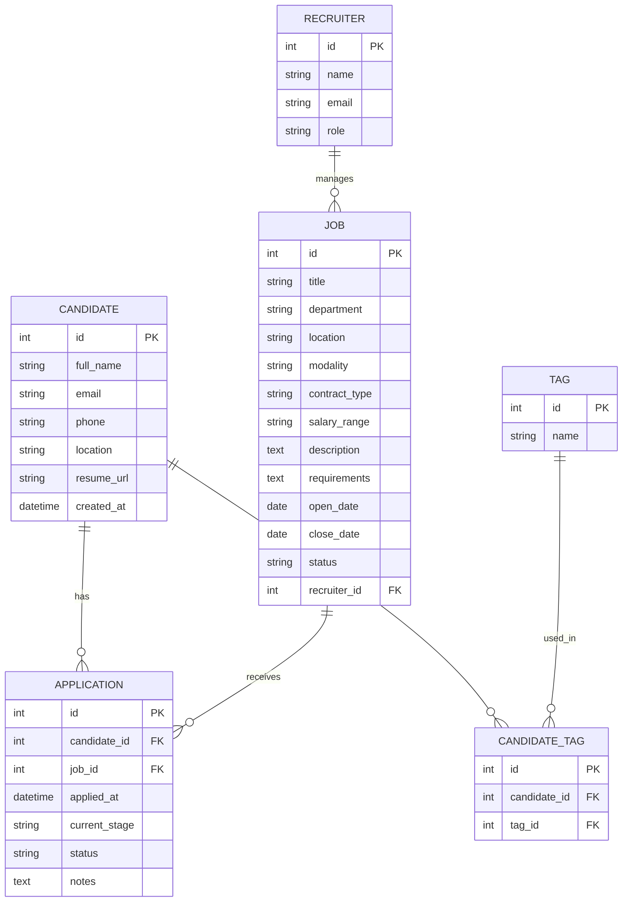
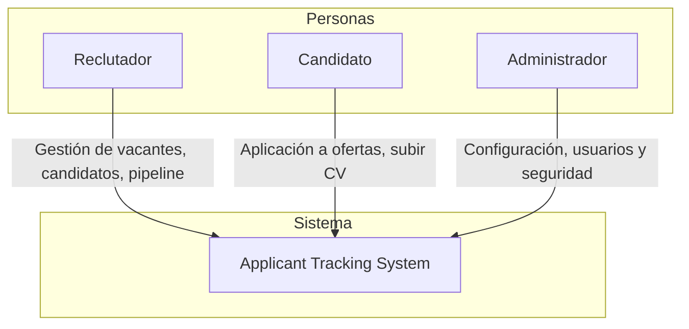
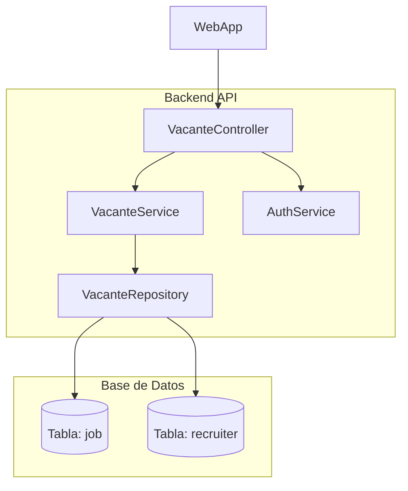

# Prompts generaddos con GPT 4

Vi mejor el uso de GPT 4 porque era más evaluar y hacer diagramas con DaC (Diagram as Code)

[Enlace al chat](https://chatgpt.com/share/6850aa58-2e10-8002-9b53-6ef77a7c084d)

## **Prompt 1:**

Eres un experto en producto, con experiencia en ATS (Applicant-Tracking System).
Necesito obtener una descripción breve y valores añadidos que aporta el sistema.

## **Respuesta:**

Aquí tienes una descripción breve y los valores añadidos clave que aporta un sistema ATS (Applicant Tracking System):

✅ Descripción breve de un ATS

Un Applicant Tracking System (ATS) es una herramienta de software diseñada para automatizar y optimizar el proceso de reclutamiento. Permite a las empresas gestionar de forma eficiente la recepción, organización, filtrado y seguimiento de candidaturas desde una única plataforma, integrando funcionalidades como publicación de ofertas, screening de CVs, entrevistas y reportes.
⭐ Valores añadidos de un ATS

    Ahorro de tiempo y recursos
    Automatiza tareas repetitivas como el filtrado de CVs, envío de emails y agendado de entrevistas.

    Mejora la experiencia del candidato
    Proporciona una aplicación más ágil, comunicación fluida y seguimiento en tiempo real.

    Reducción del sesgo
    Al estandarizar criterios de evaluación y aplicar filtros objetivos, ayuda a decisiones más imparciales.

    Centralización de procesos
    Toda la información (CVs, entrevistas, evaluaciones, feedback) se guarda en un solo lugar, facilitando el acceso colaborativo.

    Análisis y mejora continua
    Genera métricas clave como tiempo de contratación, fuentes de talento más efectivas o tasa de conversión por etapa.

    Adaptabilidad y escalabilidad
    Se ajusta al crecimiento de la empresa y puede integrarse con otras herramientas (RRHH, CRM, LinkedIn, etc.).

## **Prompt 2:**

que modelos de negocio podríamos usar para vender este sistema

## **Respuesta:**

Excelente pregunta. La elección del modelo de negocio para vender un ATS (Applicant Tracking System) puede marcar una gran diferencia en la adopción y escalabilidad del producto. A continuación te detallo los modelos de negocio más utilizados en este sector, junto con sus ventajas y cuándo conviene aplicarlos:

---

### 💼 **Modelos de negocio para vender un ATS**

#### 1. **SaaS (Software as a Service) por suscripción**

**Descripción:**
Los clientes pagan una cuota mensual o anual por el uso del sistema, con distintos planes según funcionalidades o tamaño de la empresa.

**Variantes comunes:**

- **Por número de usuarios** (ej. reclutadores activos)
- **Por número de vacantes activas o candidatos gestionados**
- **Por funcionalidades** (básico, profesional, enterprise)

**Ventajas:**

- Ingresos recurrentes predecibles
- Fácil escalabilidad
- Atractivo para startups y PYMEs por bajo coste inicial

---

#### 2. **Freemium + Upsell**

**Descripción:**
Se ofrece una versión gratuita limitada (número de vacantes, usuarios o funcionalidades) y se cobra por funciones avanzadas.

**Ventajas:**

- Atrae volumen de usuarios rápidamente
- Facilita la adopción viral
- Permite probar antes de comprar

**Recomendado si:** Tienes una interfaz intuitiva y un onboarding bien diseñado.

---

#### 3. **Pago por uso (Pay-per-use o por vacante)**

**Descripción:**
Se cobra al cliente solo cuando publica una vacante o gestiona un proceso de selección.

**Ventajas:**

- Ideal para empresas con necesidades esporádicas
- Percepción de "pago justo"

**Recomendado para:** Consultoras de RRHH o empresas con baja rotación.

---

#### 4. **White-label / Licensing**

**Descripción:**
Se licencia el ATS a terceros (ej. agencias de empleo, consultoras) para que lo ofrezcan con su marca.

**Ventajas:**

- Ingresos mayores por cliente
- Expansión a través de partners
- Ideal para B2B2C

---

#### 5. **Marketplace / Comisión por contratación**

**Descripción:**
El ATS se ofrece como plataforma abierta y se cobra una comisión por cada candidato contratado.

**Ventajas:**

- Modelo transaccional atractivo para startups
- Incentiva optimización del matching candidato-empresa

**Desafíos:** Requiere volumen y control sobre la calidad del talento.

---

#### 6. **Modelo híbrido**

**Ejemplo:**
Suscripción base + pagos adicionales por módulos (IA para screening, videollamadas, informes avanzados).

**Ventajas:**

- Flexibilidad
- Monetización gradual
- Permite adaptar precios a diferentes segmentos de clientes

---

### 🧩 Recomendación estratégica

Si estás en fase inicial o buscas tracción rápida, una combinación **Freemium + SaaS escalonado** suele ser efectiva. A medida que creces, puedes añadir módulos premium o explorar modelos de **licencia B2B** para escalar vía partners.

---

¿Quieres que te proponga un pricing tentativo o estrategia de go-to-market según un segmento objetivo?

## **Prompt 3:**

Genera un lean canvas combinando el modelo freemium y el SaaS

## **Respuesta 3:**

Perfecto. Aquí tienes un **Lean Canvas** adaptado a un **modelo de negocio Freemium + SaaS** para un ATS (Applicant Tracking System):

---

## ✅ **Lean Canvas – ATS (Freemium + SaaS)**

| Sección                                   | Contenido                                                                                                                                                                                                                                              |
| ----------------------------------------- | ------------------------------------------------------------------------------------------------------------------------------------------------------------------------------------------------------------------------------------------------------ |
| **1. Problema**                           | - Reclutamiento ineficiente por exceso de tareas manuales<br>- Dificultad para filtrar candidatos de calidad<br>- Coste elevado o poca flexibilidad de las herramientas actuales                                                                       |
| **2. Segmentos de clientes**              | - Startups y PYMEs sin equipo de RRHH<br>- Reclutadores independientes<br>- Departamentos de RRHH en empresas medianas<br>- Consultoras de selección                                                                                                   |
| **3. Propuesta de valor única**           | Un ATS ágil y accesible que automatiza procesos de selección desde el día uno, con una versión gratuita potente y opciones premium para escalar sin fricción.                                                                                          |
| **4. Solución**                           | - Plataforma cloud con pipeline visual, filtros automáticos, y panel colaborativo<br>- Integración con bolsas de empleo, LinkedIn y correo<br>- Plan freemium para empezar sin coste<br>- Planes premium escalables con funcionalidades avanzadas      |
| **5. Canales**                            | - Inbound Marketing (SEO, blog, RRSS)<br>- Alianzas con escuelas de negocio y consultoras<br>- Marketplaces de software (G2, Capterra)<br>- Referral program entre usuarios                                                                            |
| **6. Fuentes de ingreso**                 | - Suscripciones mensuales/anuales (SaaS) por plan: Starter, Growth, Pro<br>- Add-ons (evaluaciones psicométricas, IA para screening, API, informes personalizados)<br>- Servicios extra: soporte dedicado, integración con ERP                         |
| **7. Costes clave**                       | - Desarrollo y mantenimiento de software<br>- Infraestructura cloud (hosting, backups, seguridad)<br>- Marketing y adquisición de usuarios<br>- Soporte al cliente y formación<br>- Coste de integraciones (API externas)                              |
| **8. Métricas clave**                     | - CAC (Costo de adquisición de cliente)<br>- Tasa de conversión freemium → pago<br>- Churn rate<br>- LTV (valor del cliente en el tiempo)<br>- Tasa de adopción de funcionalidades premium                                                             |
| **9. Ventaja injusta (Unfair Advantage)** | - Algoritmo de screening optimizado con IA propia<br>- Onboarding ultra rápido (publica y recibe candidatos en minutos)<br>- Comunidad de usuarios que genera referidos<br>- Integraciones plug & play con herramientas populares (Slack, Gmail, etc.) |

---

Este enfoque permite capturar una base amplia de usuarios sin barrera de entrada (freemium) y convertirlos a planes de pago conforme aumentan sus necesidades o crece su negocio.

¿Te gustaría que desarrollemos ahora una estructura de **pricing por planes** o un ejemplo de **roadmap de producto**?

## **Prompt 4:**

¿Qué alternativas se pueden encontrar a tener un Applicant Tracking System (ATS) como herramienta de software diseñada para automatizar y optimizar el proceso de reclutamiento.

## **Respuesta 4:**

Buena pregunta. Aunque un **ATS** es la herramienta más habitual para automatizar y centralizar los procesos de selección, **sí existen alternativas** —algunas más manuales o especializadas— que las empresas pueden usar, dependiendo de su tamaño, presupuesto o madurez digital.

Aquí tienes un resumen de las principales **alternativas a un ATS**, con sus **ventajas e inconvenientes**:

---

## 🔄 **Alternativas a un ATS para el proceso de reclutamiento**

### 1. **Gestión manual con hojas de cálculo (Excel, Google Sheets)**

**Ventajas:**

- Bajo o nulo coste
- Flexibilidad total
- Familiaridad de uso

**Inconvenientes:**

- Propenso a errores
- Poco escalable
- No colaborativo ni automatizado
- Difícil seguimiento de KPIs

📌 **Útil para:** Microempresas o contrataciones muy puntuales

---

### 2. **Uso de plataformas de empleo directamente (LinkedIn, InfoJobs, Indeed, etc.)**

**Ventajas:**

- Acceso directo a bases de candidatos
- Publicación rápida
- Algunas incluyen filtros automáticos

**Inconvenientes:**

- Cada plataforma está aislada
- No gestionan el pipeline completo
- Pérdida de trazabilidad y control global

📌 **Útil para:** Reclutamiento reactivo, pocas vacantes, procesos simples

---

### 3. **Correo electrónico y herramientas de calendario (Gmail, Outlook, Calendly)**

**Ventajas:**

- Todos tienen acceso a estas herramientas
- Fácil de usar

**Inconvenientes:**

- No hay trazabilidad de candidatos
- Información dispersa
- No hay métricas ni control del funnel

📌 **Útil para:** Procesos pequeños y no recurrentes

---

### 4. **CRM de ventas adaptado (HubSpot, Zoho CRM, etc.)**

**Ventajas:**

- Algunos CRMs permiten adaptar flujos a procesos de RRHH
- Automatización y seguimiento decente
- Integraciones disponibles

**Inconvenientes:**

- No está pensado para reclutamiento
- Falta de funciones específicas (screening, CV parsing, etc.)

📌 **Útil para:** Empresas que ya usan un CRM y quieren centralizar herramientas

---

### 5. **Consultoras de selección o headhunters externos**

**Ventajas:**

- Delegas todo el proceso
- Acceso a redes de talento especializadas
- Rapidez en perfiles difíciles

**Inconvenientes:**

- Coste elevado (porcentaje de salario o fee fijo)
- Pérdida de control sobre el proceso
- No escalable si haces muchas contrataciones

📌 **Útil para:** Posiciones clave, directivas o técnicas difíciles de cubrir

---

### 6. **HCM o suites de RRHH completas (ej. SAP SuccessFactors, Workday, Oracle HCM)**

**Ventajas:**

- Todo en uno: reclutamiento, onboarding, nómina, evaluaciones
- Integración total con procesos de RRHH

**Inconvenientes:**

- Coste elevado
- Lenta implementación
- Puede ser demasiado complejo para empresas pequeñas

📌 **Útil para:** Grandes empresas con necesidades amplias en gestión del talento

---

### 7. **Herramientas de colaboración genéricas (Trello, Notion, Airtable)**

**Ventajas:**

- Alta personalización
- Coste bajo o gratuito
- Visualmente amigables

**Inconvenientes:**

- No están pensadas específicamente para reclutamiento
- Requieren configuración manual
- Sin parsing de CVs ni automatización profunda

📌 **Útil para:** Equipos ágiles, startups en etapa inicial

---

## 🎯 Conclusión

Aunque existen múltiples **alternativas al ATS**, ninguna logra ofrecer la **eficiencia, escalabilidad y trazabilidad** específica que ofrece una solución dedicada. Sin embargo, **pueden ser útiles en ciertos contextos** (empresas pequeñas, procesos únicos, falta de presupuesto inicial).

¿Quieres que comparemos alguna de estas alternativas con un ATS en una tabla o según un caso de uso específico (por ejemplo, reclutar 10 perfiles técnicos en 2 meses)?

## **Prompt 5:**

Define qué funcionalidades básicas tiene un ATS y descríbemelas en un listado, ordenado de mayor a menor prioridad para formar un MVP (Minimal viable Product)

## **Respuesta 5:**

Perfecto. A continuación te presento un **listado priorizado de funcionalidades básicas de un ATS**, organizadas según su **importancia para construir un MVP (Producto Mínimo Viable)**. Este enfoque permite lanzar rápido una versión funcional que resuelva el problema central: **gestionar candidaturas de forma estructurada y eficiente**.

---

## ✅ **Funcionalidades básicas de un ATS para un MVP (ordenadas de mayor a menor prioridad):**

---

### 1. **Gestión de vacantes (Job posting)**

**Descripción:**
Permite crear, editar y publicar ofertas de empleo desde la plataforma.

**Por qué es clave:**
Es el punto de entrada al proceso de selección. Sin vacantes, no hay candidatos.

---

### 2. **Recepción y almacenamiento de candidatos (Applicant database)**

**Descripción:**
Registro centralizado donde se almacenan todos los CVs y datos de candidatos aplicantes.

**Por qué es clave:**
Es la base de cualquier seguimiento. Organiza la información y evita la dispersión (emails, Excel, etc.).

---

### 3. **Pipeline visual de selección (Kanban de etapas)**

**Descripción:**
Visualización del proceso de selección en columnas: Aplicado → Entrevista → Oferta → Contratado / Rechazado.

**Por qué es clave:**
Ayuda a seguir fácilmente en qué etapa está cada candidato. Mejora la trazabilidad y colaboración.

---

### 4. **Formulario de aplicación y parsing de CV básico**

**Descripción:**
Formulario web donde los candidatos aplican, con extracción automática de datos clave del CV (nombre, email, experiencia).

**Por qué es clave:**
Facilita la entrada de datos estructurados sin depender de lectura manual.

---

### 5. **Búsqueda y filtros en la base de candidatos**

**Descripción:**
Permite buscar por nombre, vacante, experiencia, palabras clave, etc.

**Por qué es clave:**
Hace eficiente la navegación por grandes volúmenes de datos.

---

### 6. **Comentarios internos y etiquetas por candidato**

**Descripción:**
Notas privadas, comentarios de entrevistas, y etiquetado personalizable (ej. “Top”, “Tech”, “Revisar después”).

**Por qué es clave:**
Fomenta el trabajo colaborativo entre reclutadores y la clasificación inteligente.

---

### 7. **Gestión de estados y decisiones (contratado, descartado, en proceso)**

**Descripción:**
Permite registrar la decisión final sobre cada candidato y moverlos al estado correspondiente.

**Por qué es clave:**
Facilita reportes básicos y evita ambigüedades en la gestión del proceso.

---

### 8. **Comunicación con candidatos (email básico)**

**Descripción:**
Posibilidad de enviar mensajes desde la plataforma (respuestas automáticas, feedback, citas).

**Por qué es clave:**
Aunque puede hacerse fuera del ATS en fases iniciales, una comunicación mínima dentro del sistema mejora la eficiencia.

---

### 9. **Exportación de datos / reportes básicos**

**Descripción:**
Descargar datos en Excel o PDF para informes simples (número de candidatos, tasa de conversión, etc.).

**Por qué es útil (aunque no urgente):**
Ideal para análisis manual al principio. Puede postergarse si no es crítico.

---

## 🎯 MVP ideal para un ATS:

Para lanzar rápido y validarlo con usuarios, te recomiendo incluir al menos las funcionalidades **1 a 5**, y priorizar **un diseño simple, mobile-friendly y con onboarding intuitivo**.

---

¿Quieres que lo convierta en un **roadmap por fases (MVP → Beta → Versión Pro)** o diseñamos un flujo UX simplificado de candidato y reclutador?

## **Prompt 6:**

Necesigo que generes un caso de uso para la primera funcionalidad.

## **Respuesta 6:**

Perfecto. A continuación te presento un **caso de uso completo** para la funcionalidad **"Gestión de Vacantes"** dentro de un ATS, con enfoque claro, estructurado y orientado a producto.

---

## 📝 **Caso de Uso: Gestión de Vacantes**

### 1. **Nombre del caso de uso:**

Gestión de Vacantes

---

### 2. **Actor principal:**

- **Reclutador / Responsable de RRHH**

---

### 3. **Objetivo:**

Permitir al reclutador crear, editar, publicar y gestionar ofertas de empleo dentro del ATS de forma eficiente y centralizada.

---

### 4. **Precondiciones:**

- El usuario está autenticado en el sistema.
- Tiene permisos para crear o editar vacantes.

---

### 5. **Flujo principal (escenario básico):**

#### Paso 1: Acceder al módulo de vacantes

El reclutador entra en el panel de control y selecciona "Crear nueva vacante" o accede a la lista de vacantes existentes.

#### Paso 2: Completar los datos de la vacante

El sistema muestra un formulario con campos clave:

- Título del puesto
- Departamento o área
- Modalidad (presencial, híbrido, remoto)
- Ubicación
- Tipo de contrato
- Rango salarial (opcional)
- Descripción del puesto
- Requisitos (técnicos y blandos)
- Idiomas / certificaciones
- Fecha de publicación y cierre

#### Paso 3: Guardar y publicar la vacante

El reclutador puede:

- Guardar como borrador
- Publicar directamente (si tiene permisos)
- Compartir con otros usuarios internos para validación

#### Paso 4: Distribución automática (si aplica)

El sistema ofrece opciones de distribución:

- Publicar en portal de empleo propio
- Compartir en redes sociales (LinkedIn, etc.)
- Integrar con portales externos (opcional en futuras versiones)

#### Paso 5: Visualizar el estado de la vacante

La vacante aparece en un panel con métricas básicas:

- Nº de candidatos aplicados
- Estado: Activa / Cerrada / Borrador
- Fecha de publicación
- Responsable asignado

---

### 6. **Flujos alternativos:**

- **Editar vacante existente:** El reclutador accede a una vacante publicada y modifica su contenido.
- **Duplicar vacante:** Crear una nueva vacante a partir de otra ya existente.
- **Cerrar vacante:** Una vez cubierta, el sistema permite cerrarla manual o automáticamente (basado en fecha o contratación).
- **Asignar responsables:** Permite que varios usuarios gestionen una misma vacante.

---

### 7. **Postcondiciones:**

- La vacante queda registrada en el sistema.
- Está disponible para recibir candidaturas (si está publicada).
- El sistema inicia el tracking de métricas por vacante.

---

### 8. **Reglas de negocio clave:**

- No se puede publicar una vacante sin campos obligatorios completos.
- Las vacantes cerradas no aceptan nuevas aplicaciones.
- Los usuarios sin permisos no pueden eliminar vacantes.
- Cada vacante debe tener un responsable asignado.

---

### 9. **Requisitos técnicos relacionados:**

- Base de datos estructurada para almacenar los campos de vacantes
- API REST para CRUD de vacantes
- Motor de búsqueda para listar y filtrar vacantes
- Lógica de permisos por rol

---

### 🔚 ¿Siguiente paso?

Puedo ayudarte a convertir este caso en un **diagrama de casos de uso**, en **user stories para desarrollo ágil**, o diseñar los **mockups de interfaz** para el formulario y vista general de vacantes.

¿Te interesa alguno de esos siguientes pasos?

## **Prompt 7:**

genera el diagrama de caso de uso con plantuml y dame el código necesario para la documentación

## **Respuesta:**

Perfecto. A continuación te presento el diagrama de caso de uso en PlantUML para la funcionalidad Gestión de Vacantes dentro de un ATS, junto con el código necesario para documentarlo correctamente.
✅ Diagrama de Caso de Uso: Gestión de Vacantes (ATS)
🧩 Código PlantUML

```plantUML

@startuml
left to right direction
skinparam packageStyle rectangle
skinparam actorStyle awesome

actor "Reclutador" as R

rectangle "ATS - Gestión de Vacantes" {

usecase "Crear vacante" as UC1
usecase "Editar vacante" as UC2
usecase "Publicar vacante" as UC3
usecase "Cerrar vacante" as UC4
usecase "Duplicar vacante" as UC5
usecase "Asignar responsables" as UC6
usecase "Distribuir vacante\na portales externos" as UC7
usecase "Ver estado de vacante" as UC8

}

R --> UC1
R --> UC2
R --> UC3
R --> UC4
R --> UC5
R --> UC6
R --> UC7
R --> UC8

@enduml

```

📌 ¿Cómo usar este código?

    Copia el contenido en un editor compatible con PlantUML.

    Puedes usar herramientas como:

        PlantUML Online Server

        PlantUML QEditor

        Integraciones en VS Code con la extensión PlantUML

        Herramientas como Docusaurus, MkDocs, o Confluence que aceptan código PlantUML para documentación técnica.

¿Quieres que te prepare también el mismo diagrama pero con más actores (por ejemplo, Admin, Candidato) o para otro módulo como “Gestión de Candidatos”?

## **Prompt 8:**

Genera las funcionalidades detalladas y sus diagramas de casos de uso para las funcionalidades "Recepción y almacenamiento de candidatos" y "Formulario de aplicación y pharsing de CV básico"

## **Respuesta 8:**

Claro, aquí tienes la definición detallada de las dos funcionalidades junto con su respectivo diagrama de caso de uso en PlantUML. Lo estructuro como hicimos antes: primero la descripción funcional, y luego el código PlantUML listo para documentación técnica.
🧩 1. Recepción y almacenamiento de candidatos (Applicant Database)
✅ Descripción funcional:

Objetivo:
Centralizar la información de todos los candidatos que aplican a vacantes, asegurando su trazabilidad y disponibilidad en un repositorio estructurado.
👤 Actor principal:

    Candidato

    Reclutador

🔄 Flujos principales:

    El candidato aplica a una vacante.

    El sistema almacena su información en la base de datos.

    El reclutador accede a la ficha del candidato.

    El reclutador puede actualizar el estado, añadir notas o etiquetar.

    El sistema permite búsqueda y filtrado de candidatos.

📐 Reglas de negocio clave:

    Cada aplicación debe estar vinculada a una vacante.

    No se permite duplicar candidatos exactos (misma vacante, mismo correo).

    Se almacena historial de cada aplicación.

📄 PlantUML – Applicant Database

```PlantUML

@startuml
left to right direction
skinparam packageStyle rectangle
skinparam actorStyle awesome

actor "Candidato" as C
actor "Reclutador" as R

rectangle "ATS - Applicant Database" {

usecase "Aplicar a vacante" as UC1
usecase "Guardar datos del candidato" as UC2
usecase "Vincular candidato a vacante" as UC3
usecase "Ver perfil del candidato" as UC4
usecase "Actualizar estado del candidato" as UC5
usecase "Añadir notas o etiquetas" as UC6
usecase "Buscar/filtrar candidatos" as UC7

}

C --> UC1
UC1 --> UC2
UC2 --> UC3

R --> UC4
R --> UC5
R --> UC6
R --> UC7
UC3 --> UC4

@enduml

```

🧩 2. Formulario de aplicación y parsing de CV básico
✅ Descripción funcional:

Objetivo:
Permitir que los candidatos apliquen a una vacante mediante un formulario estructurado y, opcionalmente, subir su CV para extracción automática de información (parsing).
👤 Actor principal:

    Candidato

🔄 Flujos principales:

    El candidato accede al formulario de una vacante.

    Completa campos obligatorios y adjunta su CV.

    El sistema hace parsing del CV y extrae datos clave (nombre, email, experiencia).

    Se muestra vista previa para confirmación.

    El sistema registra la aplicación y la asocia con la vacante.

📐 Reglas de negocio clave:

    Parsing debe fallar con retroalimentación clara si el CV no es legible.

    Campos como nombre y email deben estar presentes antes de enviar.

    El sistema debe permitir revisión antes de enviar la aplicación.

📄 PlantUML – Formulario + Parsing de CV

```PlantUML

@startuml
left to right direction
skinparam packageStyle rectangle
skinparam actorStyle awesome

actor "Candidato" as C

rectangle "ATS - Formulario de aplicación + CV Parsing" {

usecase "Acceder a formulario de vacante" as UC1
usecase "Completar campos y subir CV" as UC2
usecase "Realizar parsing del CV" as UC3
usecase "Previsualizar y confirmar envío" as UC4
usecase "Enviar aplicación" as UC5

}

C --> UC1
C --> UC2
UC2 --> UC3
UC3 --> UC4
UC4 --> UC5

@enduml

```

¿Te gustaría que prepare ahora la tercera funcionalidad (pipeline visual de selección) o que genere una versión completa con todos los casos de uso en un solo diagrama integrado para documentación?

## **Prompt 9:**

para los tres casos de uso necesito generar el modelo de datos entidad relación, realiza el diagrama también con mermaid para mostrar todas las entidades, relaciones y atributos (nombre y tipo)

## **Respuesta 9:**

Perfecto. A continuación te presento el **modelo entidad-relación (ER)** que cubre los **tres casos de uso clave del ATS**:

- Gestión de Vacantes
- Recepción y almacenamiento de candidatos
- Formulario de aplicación + Parsing de CV

Este modelo está representado en formato **Mermaid**, que puedes incrustar fácilmente en documentación en Markdown, Docusaurus, Notion, Obsidian, MkDocs, etc.

---

## ✅ **Modelo de datos ER en Mermaid (ATS básico)**



---

### 🧩 Entidades y atributos (resumen):

| Entidad           | Atributos clave                                                            |
| ----------------- | -------------------------------------------------------------------------- |
| **CANDIDATE**     | `full_name`, `email`, `resume_url`, `location`, `created_at`               |
| **JOB**           | `title`, `department`, `modality`, `description`, `requirements`, `status` |
| **APPLICATION**   | `candidate_id`, `job_id`, `current_stage`, `status`, `applied_at`, `notes` |
| **RECRUITER**     | `name`, `email`, `role`                                                    |
| **TAG**           | `name` (ej. "Top", "Revisar", "Tech Senior")                               |
| **CANDIDATE_TAG** | tabla intermedia N\:M entre candidatos y etiquetas                         |

---

### 🛠 ¿Cómo usarlo?

- Puedes pegar directamente el código en cualquier herramienta que soporte **Mermaid.js**.
- Si necesitas convertirlo a **SQL** para generación de base de datos, puedo generarlo también.
- Puedes ampliar este modelo añadiendo por ejemplo entidades como `INTERVIEW`, `DOCUMENT`, `NOTIFICATION`, o `FEEDBACK`.

---

¿Quieres que también te genere el **SQL de creación de tablas** a partir de este modelo o prefieres generar el modelo físico para PostgreSQL / MySQL?

## **Prompt 10:**

necesito el diseño de todo el sistema explicado por partes y con un diagrama en mermaid

## **Respuesta 10:**

Perfecto. A continuación te presento el **diseño completo del sistema ATS (Applicant Tracking System)** dividido por capas funcionales, explicado por partes, junto con un **diagrama general de arquitectura en formato Mermaid**.

---

## 🧩 DISEÑO GENERAL DEL SISTEMA ATS – EXPLICADO POR PARTES

El sistema se estructura en **5 capas principales**:

---

### 1. 🧭 **Capa de Presentación (Frontend / UI)**

Interfaz web accesible para:

- **Reclutadores** (gestión de vacantes, candidatos, pipeline)
- **Candidatos** (aplicación, formulario, carga de CV)
- **Administradores** (gestión de usuarios y permisos)

**Tecnologías sugeridas**: React, Vue, Next.js, TailwindCSS

**Módulos clave:**

- Página de login / registro
- Dashboard de vacantes
- Formulario de aplicación
- Vista de candidato y su progreso
- Kanban del pipeline de selección

---

### 2. 🧠 **Capa de Lógica de Negocio (Backend / API)**

Expone una **API RESTful o GraphQL** para manejar:

- CRUD de vacantes, candidatos y aplicaciones
- Procesamiento de parsing de CV
- Gestión de etiquetas, estados y comunicación
- Validaciones, control de permisos y autenticación

**Tecnologías sugeridas**: Node.js, Python (FastAPI o Django), Laravel, Java Spring Boot

---

### 3. 🗄️ **Capa de Persistencia de Datos (Base de datos)**

Modelo entidad-relación ya definido (ver mensaje anterior) con las entidades:

- `CANDIDATE`, `JOB`, `APPLICATION`, `RECRUITER`, `TAG`, `CANDIDATE_TAG`

**Tecnologías sugeridas**: PostgreSQL, MySQL, MongoDB (si es no relacional)

---

### 4. 🤖 **Servicios auxiliares (parsing y notificaciones)**

- **Parsing de CV** (extracción automática de datos desde PDF/Word): puede usar una librería como `pyresparser` o una API externa como Sovren o Affinda.
- **Envío de correos**: notificación de aplicación recibida, estado actualizado, etc.
- **Almacenamiento de archivos**: CVs en S3, Cloudinary o similar.

---

### 5. 🔐 **Seguridad y Autenticación**

- JWT o OAuth para reclutadores y admin
- Captcha o validaciones para candidatos
- Control de roles: Admin, Reclutador, Viewer

---

## 🖼️ DIAGRAMA GENERAL DEL SISTEMA – MERMAID

```mermaid
graph TD
  subgraph Frontend [Capa de Presentación]
    A1[Portal del Reclutador]
    A2[Portal del Candidato]
    A3[Login/Registro]
    A4[Panel Kanban]
  end

  subgraph Backend [API / Lógica de Negocio]
    B1[Controlador de Vacantes]
    B2[Controlador de Candidatos]
    B3[Controlador de Aplicaciones]
    B4[Parser de CVs]
    B5[Gestor de Estados y Etiquetas]
    B6[Gestión de usuarios / roles]
  end

  subgraph DB [Base de Datos]
    D1[(Vacantes)]
    D2[(Candidatos)]
    D3[(Aplicaciones)]
    D4[(Reclutadores)]
    D5[(Etiquetas)]
    D6[(Candidato_Etiqueta)]
  end

  subgraph ServiciosExternos [Servicios Auxiliares]
    S1[API Parsing CV]
    S2[Servicio de Email]
    S3[Almacenamiento (CVs)]
  end

  A1 --> B1
  A1 --> B3
  A1 --> B2
  A1 --> B4
  A2 --> B3
  A2 --> B4
  A3 --> B6
  A4 --> B3

  B1 --> D1
  B2 --> D2
  B3 --> D3
  B5 --> D5
  B5 --> D6
  B6 --> D4

  B4 --> S1
  B3 --> S2
  B2 --> S3

  D1 -->|relación| D3
  D2 -->|relación| D3
  D2 -->|etiquetado| D6
  D5 -->|etiquetado| D6
```

---

## 🧩 RESUMEN MODULAR

| Módulo              | Funciones principales                                                |
| ------------------- | -------------------------------------------------------------------- |
| **Vacantes**        | Crear, editar, publicar, cerrar                                      |
| **Candidatos**      | Registrar, ver perfil, etiquetas, actualizar estado                  |
| **Aplicaciones**    | Registrar aplicación, vincular CV, mover en pipeline                 |
| **Parsing de CVs**  | Extraer nombre, email, experiencia desde PDF/Word                    |
| **Pipeline visual** | Ver candidatos por etapas, arrastrar para mover                      |
| **Usuarios/Roles**  | Control de acceso, múltiples reclutadores, gestión de permisos       |
| **Notificaciones**  | Email de confirmación, actualización de estado, aviso a responsables |

---

## ¿Próximos pasos?

Puedo ayudarte a generar:

- Diagrama de despliegue en la nube (Docker, AWS, etc.)
- Diagrama de clases para backend (Python/Java)
- Diseño de endpoints RESTful detallado (`/jobs`, `/candidates`, `/apply`, etc.)
- Diagrama de flujo del proceso de aplicación del candidato (UX)

¿Quieres avanzar con alguno de estos?

## **Prompt 12:**

necesito que representes también el sistema de forma más técnica con los componentes como api, web, bbdd etc. Preparalo con componentes en AWS

## **Respuesta 12:**

Perfecto. A continuación te presento una **representación técnica del sistema ATS basado en arquitectura de componentes AWS**, ideal para documentar una solución escalable y robusta en la nube.

Usaremos servicios comunes de **AWS**, incluyendo:

- **Frontend (hosting)**
- **API backend**
- **Base de datos**
- **Almacenamiento de archivos (CVs)**
- **Parsing y servicios auxiliares**
- **Autenticación**
- **Comunicación entre componentes**

---

## 🧱 **Descripción general de componentes AWS para un ATS**

| Componente            | Servicio AWS Sugerido                          | Propósito                                          |
| --------------------- | ---------------------------------------------- | -------------------------------------------------- |
| Frontend Web          | Amazon S3 + CloudFront                         | Hosting estático del sitio React/Vue               |
| API REST              | AWS API Gateway + AWS Lambda (o ECS/Fargate)   | Lógica de negocio                                  |
| Parsing CVs           | AWS Lambda (con libs de parsing o API externa) | Proceso de extracción de datos del CV              |
| Base de datos         | Amazon RDS (PostgreSQL o MySQL)                | Persistencia de vacantes, candidatos, aplicaciones |
| Almacenamiento de CVs | Amazon S3                                      | Subida y lectura de CVs (PDF, Word)                |
| Autenticación         | Amazon Cognito                                 | Registro, login, gestión de sesiones               |
| Notificaciones        | Amazon SES o SNS                               | Correos automáticos o alertas internas             |
| Seguridad             | IAM + WAF + SSL                                | Autorización, validación, protección web           |
| Observabilidad        | CloudWatch + X-Ray                             | Logs, trazabilidad, rendimiento                    |

---

## 📊 Diagrama técnico del sistema ATS en AWS (Mermaid)

```mermaid
graph TD
  subgraph Usuario
    U1[🧑 Reclutador / Candidato]
  end

  subgraph Frontend
    FE[S3 + CloudFront (Web App)]
  end

  subgraph Auth
    COGNITO[Amazon Cognito\n(Auth y gestión de usuarios)]
  end

  subgraph API
    APIGW[API Gateway]
    LAMBDA1[Lambda\n(Logica Vacantes/Candidatos)]
    LAMBDA2[Lambda\n(Parsing de CVs)]
  end

  subgraph Datos
    RDS[(Amazon RDS\n(PostgreSQL))]
    S3CV[S3 Bucket\n(CVs)]
  end

  subgraph Notificaciones
    SES[Amazon SES\n(Emails)]
  end

  subgraph Monitoreo
    CW[CloudWatch Logs]
    XRAY[X-Ray]
  end

  U1 --> FE
  FE --> COGNITO
  FE --> APIGW
  COGNITO --> APIGW

  APIGW --> LAMBDA1
  LAMBDA1 --> RDS
  LAMBDA1 --> S3CV
  LAMBDA1 --> SES
  LAMBDA1 --> CW
  LAMBDA1 --> XRAY

  LAMBDA1 --> LAMBDA2
  LAMBDA2 --> S3CV
  LAMBDA2 --> CW

  RDS --> CW
  SES --> CW
```

---

## ✅ Detalles adicionales:

- **Hosting del frontend (SPA)**:
  React o VueJS desplegado como app estática en S3, cacheado con CloudFront. Con HTTPS y WAF.

- **Autenticación**:
  Cognito maneja usuarios (signup/login), pools de usuarios para reclutadores y candidatos, tokens JWT usados en API Gateway.

- **API backend**:
  Arquitectura serverless basada en Lambda, escalable automáticamente. También podría usarse **ECS + Fargate** si se requiere mayor control de contenedores.

- **CV Parsing**:
  Lambda especializado con bibliotecas (`pdfminer`, `docx`, o APIs como Affinda) que procesa los archivos subidos a S3.

- **Persistencia**:
  RDS (PostgreSQL) con el modelo relacional definido antes. Uso de Aurora Serverless es opcional.

- **Almacenamiento de archivos**:
  CVs subidos directamente por candidatos al bucket S3 mediante URL prefirmada.

- **Notificaciones**:
  SES usado para notificaciones por email (confirmación de aplicación, estado actualizado, etc.)

- **Logs y trazabilidad**:
  CloudWatch para logs centralizados, X-Ray para seguimiento de solicitudes en API.

---

## 🧩 ¿Qué puedes hacer con este diseño?

- Generar **infraestructura como código** (IaC) usando **Terraform** o **AWS CDK**
- Integrar CI/CD con **GitHub Actions** o **AWS CodePipeline**
- Asegurar el entorno con **VPC**, **WAF** y **Cognito Groups**

---

¿Te gustaría que convierta esta arquitectura en código Terraform o CDK para desplegarlo? ¿O quieres una alternativa basada en contenedores (ECS/Fargate) en lugar de Lambda?

## **Prompt 13:**

genera un diagrama C4 de todo el sistema ATS y bajando hasta la funcionalidad de la gestión de vacantes. Realiza el diagrama en mermaid

## **Respuesta 13:**

Perfecto. A continuación te presento un **modelo C4 completo en formato Mermaid** para el sistema **ATS (Applicant Tracking System)**, bajando hasta el **nivel de Componentes (C3)** en la funcionalidad de **Gestión de Vacantes**.

---

# 🧭 C4 Model – ATS (Applicant Tracking System)

El modelo C4 tiene **4 niveles**:

1. **Contexto (C1)**: visión general del sistema en su ecosistema
2. **Contenedores (C2)**: aplicaciones, bases de datos, servicios
3. **Componentes (C3)**: módulos lógicos dentro de una aplicación
4. **Código (C4)** _(opcional – no cubierto aquí)_

---

## ✅ C1 – Diagrama de Contexto



---

## ✅ C2 – Diagrama de Contenedores

```mermaid
graph TB
  subgraph Usuarios
    R1[👤 Reclutador]
    C1[👤 Candidato]
  end

  subgraph Frontend (S3 + CloudFront)
    WebApp[SPA: React/Vue App]
  end

  subgraph Backend API
    API[REST/GraphQL API (Lambda / Express)]
    Auth[Cognito (Auth)]
  end

  subgraph Infraestructura
    DB[(RDS PostgreSQL)]
    Files[S3 Bucket (CVs)]
    Mail[SES (Email)]
    Parser[Lambda Parsing CV]
  end

  R1 --> WebApp
  C1 --> WebApp
  WebApp --> Auth
  WebApp --> API
  API --> DB
  API --> Files
  API --> Parser
  API --> Mail
  Parser --> Files
```

---

## ✅ C3 – Diagrama de Componentes (Funcionalidad: Gestión de Vacantes)



---

## 🧩 Explicación rápida de componentes de gestión de vacantes:

| Componente          | Descripción                                                          |
| ------------------- | -------------------------------------------------------------------- |
| `VacanteController` | Recibe las peticiones HTTP (REST/GraphQL)                            |
| `VacanteService`    | Aplica lógica de negocio (validación, reglas)                        |
| `VacanteRepository` | Accede a la base de datos relacional                                 |
| `AuthService`       | Verifica que el usuario tenga permisos para crear/modificar vacantes |
| `DB: job`           | Tabla donde se almacenan los registros de vacantes                   |
| `DB: recruiter`     | Tabla de usuarios tipo reclutador                                    |

---

## 🧩 ¿Qué sigue?

Puedo generar ahora:

- Diagrama C4 para **gestión de candidatos o pipeline**
- **Código de ejemplo** para estos componentes (Node.js, Python, etc.)
- Diseño C4 en herramientas visuales como Structurizr DSL si lo necesitas para exportar

¿Te gustaría avanzar con eso?
